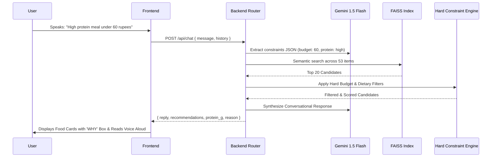

# CnteenAI — Technical Architecture & Implementation Guide

> **AI-Powered Campus Nutrition, Diet Optimization & Smart Canteen Platform**  
> *Built for TCS Hackathon*

---

## 1. Project Overview & Problem Statement

College canteens often present students with fragmented menus, unclear nutritional information, long wait queues, and inflexible meal choices that make it difficult to balance fitness goals (calorie deficit, muscle building, clean eating) with a tight student budget.

**CnteenAI** solves this by providing a unified, AI-driven diet and canteen ordering platform. It bridges generative AI intelligence, real-time vector search, and interactive WebGL/modern web animations to recommend personalized, budget-friendly, macro-balanced meals with full explainability (**"WHY"** each meal is suggested).

```mermaid
graph TD
    A[Student / User] -->|Voice Input / Text / Goals| B[CnteenAI Frontend (React + Vite)]
    B -->|FastAPI REST Endpoints| C[Backend Engine (Python)]
    C -->|Natural Language Understanding| D[Google Gemini 1.5 Flash]
    C -->|Semantic Craving Match| E[FAISS Vector Search Index]
    C -->|Hard Diet & Budget Rules| F[Deterministic Constraint Engine]
    F -->|Ranked Dishes + 'WHY' Rationale| B
    B -->|Interactive Voice Readout & UI| A
```

---

## 2. Tech Stack: What We Used & Why

### Frontend Architecture

| Technology | Purpose | Why We Chose It |
|---|---|---|
| **React 18 + Vite** | Core UI Framework & Build Tool | Instant Hot Module Replacement (HMR), sub-second build times, lightweight component architecture. |
| **Tailwind CSS** | Styling & Theme Engine | Utility-first CSS supporting instant Dark/Light mode switching, responsive container queries, and clean design tokens. |
| **Framer Motion** | UI Motion & Micro-interactions | Physics-based spring animations for modal popups, dish showcases, floating action buttons, and animated audio waveforms. |
| **OGL (WebGL Library)** | Specular Shader Shimmer Engine | Ultra-lightweight WebGL library (~10KB) enabling high-performance GPU-rendered specular lighting without the overhead of Three.js. |
| **Web Speech API** | Voice Input (STT) & Audio Readout (TTS) | Zero-latency, browser-native speech recognition (`en-IN`) and speech synthesis without requiring third-party paid audio APIs. |
| **Lucide React & Hugeicons** | Vector Iconography | Clean, minimal, modern line icons replacing cartoonish emojis for a sleek, medical-grade aesthetic. |
| **Axios** | HTTP Client | Reliable promise-based REST communication with FastAPI backend endpoints. |

---

### Backend Architecture

| Technology | Purpose | Why We Chose It |
|---|---|---|
| **FastAPI** | High-Performance REST API | Async native performance, automatic OpenAPI/Swagger documentation, robust Pydantic data validation. |
| **Uvicorn** | ASGI Web Server | Production-ready, lightning-fast asynchronous request handling on Python. |
| **Google Gemini 1.5 Flash** | Large Language Model (LLM) | Ultra-fast token generation, low latency, advanced JSON extraction for dietary constraint parsing. |
| **FAISS (Facebook AI Similarity Search)** | Vector Search & Semantic Craving Index | Sub-millisecond vector similarity search across dish ingredients, descriptions, and mood tags. |
| **Sentence-Transformers (`all-MiniLM-L6-v2`)** | Text Embedding Model | Generates dense 384-dimensional embeddings for semantic food matching with low CPU overhead. |
| **Pydantic v2** | Data Validation & Schema Modeling | Strict typing and validation for `MenuItem`, `RecommendedItem`, and user constraint payloads. |

---

## 3. Core Modules: How It Works

### 1. Specular Shimmer Button (`<SpecularButton />`)
- **How It Works:** Renders a 2D fragment shader on a WebGL `<canvas>` overlaid on top of a styled container.
- **Math Behind the Effect:** Uses a **Signed Distance Field (SDF)** calculation for rounded rectangular borders:
  $$\text{dist} = \text{roundedBoxSDF}(\text{pixelCoord}, \text{dimensions}, \text{radius})$$
- Tracks mouse coordinates with exponential lerping ($\text{velocity} \times 0.15$) and proximity falloff:
  $$\text{shine} = \exp\left(-\left(\frac{\text{dist}}{\text{shineFade}}\right)^2\right) \times \text{intensity}$$
- **Result:** Realistic metallic/glass light glints that follow the user's cursor when hovering near the top CTA.

---

### 2. Live Voice Assistant Engine (`useVoiceAssistant.js`)
- **Speech-to-Text (STT):** Uses `window.webkitSpeechRecognition` with continuous interim results. As the user speaks, words are streamed into the input bar in real-time. On silence detection, it auto-dispatches the recommendation query.
- **Text-to-Speech (TTS):** Uses `window.speechSynthesis`. Strips markdown tokens and sanitizes text (`₹` $\rightarrow$ *"rupees"*), selecting natural neural voices.
- **Voice Visualizer:** Generates 5-bar animated audio waveforms that pulse in real-time while speaking or listening.

---

### 3. Floating Side-Bottom Animated Chatbot (`FloatingChatBot.jsx`)
- **How It Works:** Rather than cluttering the main screen, the AI Concierge lives as a floating action button at `bottom-6 right-6`.
- **Animation Mechanics:** Uses `AnimatePresence` with spring physics:
  ```jsx
  initial={{ opacity: 0, scale: 0.85, y: 35, transformOrigin: 'bottom right' }}
  animate={{ opacity: 1, scale: 1, y: 0 }}
  exit={{ opacity: 0, scale: 0.85, y: 35 }}
  transition={{ type: 'spring', stiffness: 350, damping: 28 }}
  ```
- **App-Wide Triggering:** Clicking *"Get Diet Plan"* in the Hero, selecting a target in the Macro Calculator, or clicking *"Diet Concierge"* in the Navbar automatically pops open the floating chatbot and populates the query.

---

### 4. Hybrid Recommendation Pipeline with Explainability ("WHY")

The backend recommendation engine uses a **4-stage hybrid architecture**:



#### The "WHY" Explainability Engine:
Every single dish card across the application displays an explicit **"WHY"** callout detailing:
1. **Protein & Macro Quality:** e.g., *"High protein (16g) power meal"*.
2. **Budget Savings:** Exact savings calculation (e.g., *"Saves ₹15 under your ₹60 limit"*).
3. **Speed & Prep Time:** e.g., *"Ready in 3m rush-friendly"*.
4. **Calorie Deficit Fit:** e.g., *"Calorie-conscious (180 kcal)"*.

---

### 5. Protein Badges & Active Diet Plate Tray
- **Protein Badges (`ProteinBadge.jsx`):** Dynamically calculates and renders badges (`⚡ 18g Protein`) across all 53+ items, combos, and chat recommendations with special styling for high-protein meals ($\ge 14\text{g}$).
- **Active Diet Tray (`TrayModal.jsx`):** Aggregates total calories, combined protein intake, estimated kitchen wait time, and generates a randomized 3-digit order token (`#482`) for counter pickup.

---

## 4. Directory Structure

```
canteen-ai/
├── backend/
│   ├── data/
│   │   └── menu.json             # 53+ items with calories, protein_g, tags, ratings
│   ├── models/
│   │   ├── menu_item.py          # Pydantic MenuItem and MenuResponse models
│   │   └── session.py            # ChatRequest, RecommendedItem, UserConstraints
│   ├── routers/
│   │   ├── chat.py               # /api/chat endpoint
│   │   └── menu.py               # /api/menu and /api/menu/categories
│   ├── services/
│   │   ├── budget_filter.py      # Deterministic budget & dietary hard filters
│   │   ├── llm_service.py        # Gemini 1.5 Flash wrapper with safe fallbacks
│   │   ├── mood_mapper.py        # Mood profiles & keyword scoring
│   │   ├── recommender.py        # Hybrid ranking engine + WHY builder
│   │   └── vector_search.py      # FAISS semantic vector search
│   ├── main.py                   # FastAPI app entry point & CORS
│   └── requirements.txt          # Python dependencies
│
└── frontend/
    ├── src/
    │   ├── components/
    │   │   ├── BudgetSlider.jsx          # Interactive budget scrubber
    │   │   ├── ChatWindow.jsx            # Core chat conversation window
    │   │   ├── ComboOptimizer.jsx        # Value combo meal pairings
    │   │   ├── DietGoalCalculator.jsx    # Campus macro goal calculator
    │   │   ├── FloatingChatBot.jsx       # Side-bottom animated chat modal
    │   │   ├── FoodAnimation.jsx         # Framer motion culinary graphics
    │   │   ├── FoodCard.jsx              # Recommendation card with WHY callout
    │   │   ├── Footer.jsx                # Diet footer
    │   │   ├── HeroDiet.jsx              # Hero banner with SpecularButton
    │   │   ├── InteractiveFoodShowcase.jsx # Animated Culinary Studio
    │   │   ├── MessageBubble.jsx         # Message bubble with TTS read aloud
    │   │   ├── MoodPicker.jsx            # Mood & vibe selector chips
    │   │   ├── NavbarAxial.jsx           # Clean navigation with theme toggle
    │   │   ├── ProteinBadge.jsx          # Dynamic protein pill badge
    │   │   ├── QuickReplies.jsx          # Instant prompt chips
    │   │   ├── SpecularButton.jsx        # WebGL shader shimmer button
    │   │   ├── SpecularButton.css        # Shader overlay styles
    │   │   ├── TrayModal.jsx             # Active diet plate checkout modal
    │   │   └── VoiceAssistantBar.jsx     # Audio waveform & mic controls
    │   ├── hooks/
    │   │   └── useVoiceAssistant.js      # Web Speech API STT/TTS custom hook
    │   ├── pages/
    │   │   └── MenuPage.jsx              # 53-item live menu explorer
    │   ├── api.js                        # Axios API integration
    │   ├── App.jsx                       # Main application shell
    │   └── index.css                     # Tailwind CSS & custom design tokens
    ├── package.json
    └── vite.config.js
```

---

## 5. How to Run Locally

### Prerequisites
- Node.js 18+ and npm
- Python 3.10+

### Step 1: Start Backend API
```bash
cd canteen-ai/backend
pip install -r requirements.txt
python -m uvicorn main:app --host 127.0.0.1 --port 8000 --reload
```
- **API Server:** `http://127.0.0.1:8000`
- **Swagger Docs:** `http://127.0.0.1:8000/docs`

### Step 2: Start Frontend Application
```bash
cd canteen-ai/frontend
npm install
npm run dev
```
- **Web App:** `http://localhost:5173`

---

## 6. Summary of Key Achievements
- **Modern WebGL Integration:** Custom shader specular button tracking cursor proximity.
- **Multimodal Voice Interaction:** Hands-free speech recognition and audio readout.
- **Explainable AI (XAI):** Clear **"WHY"** breakdown for every dish recommendation.
- **Nutritional Awareness:** Real-time protein badges and live macro plate tracking.
- **Minimalist Clean UI:** Dark/Light theme toggle with high contrast and zero cartoon clutter.
